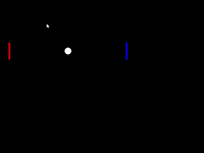

# Force Ball Game

## Overview

The **Force Ball Game** is an interactive game that uses EEG data to control the movement of a ball on the screen. EEG signal data is processed to simulate forces that affect the ball's trajectory, providing a unique and immersive gaming experience.

Built with Python, the game utilizes the `pygame` library for graphics and `pylsl` for EEG data acquisition. Players can also manually control the ball's movement using keyboard inputs.

## Features

- **Real-time EEG Integration**: Control the ball's movement using EEG data.
- **Two Player Control**: Players can adjust the force applied to the ball via keyboard controls.
- **Interactive Graphics**: Simple and engaging graphical interface with players and a ball.

## Requirements

- Python 3.x
- `pygame`
- `pylsl`
- `numpy`
- `scipy`

## Installation

1. **Clone the Repository**

   ```bash
   git clone https://github.com/touchhowling/BrainGame.git
   cd BrainGame
   ```

2. **Install Dependencies**

   ```bash
   pip install pygame pylsl numpy scipy
   ```

## Usage

1. **Start the getArduinoData code**

   Ensure your EEG device is connected and run the `getArduinoData.py` script to read data from the Arduino.

   ```bash
   python getArduinoData.py
   ```

2. **Run the Game**

   With the EEG data thread running, start the game by executing the `mygame.py` script:

   ```bash
   python mygame.py
   ```

   The game window should open, displaying the interactive game interface.

## Game Demonstration

Here's a preview of the game interface:



## Issues

- **Drift Issue**: The ball may drift over time due to accumulated small errors in position updates or force calculations. This can be mitigated by refining the position update algorithm.

- **Latency Issue**: There might be latency in updating the ball's position in response to EEG data. This could be due to delays in data acquisition, processing, or rendering. Optimizing data handling and processing may help ensure smoother gameplay.

## Contributing

Feel free to contribute by opening issues or submitting pull requests. Your feedback and contributions are welcome!
